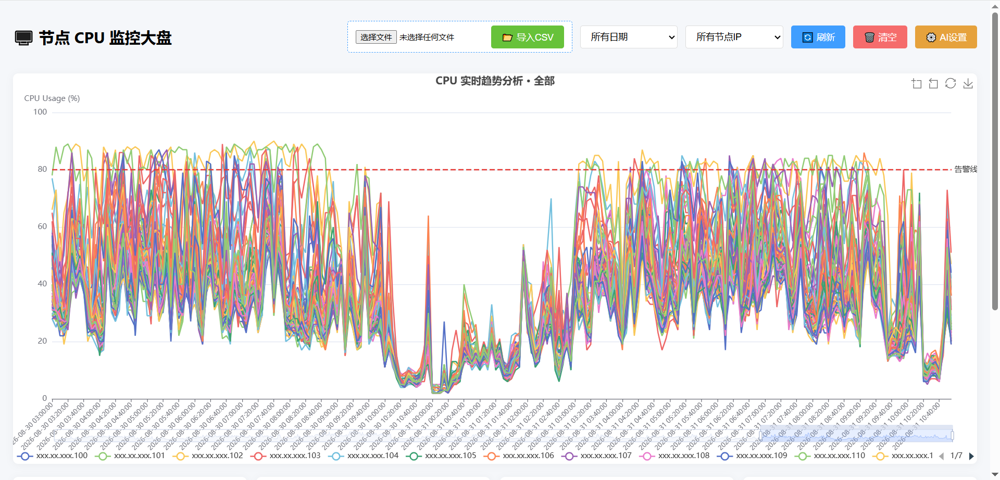
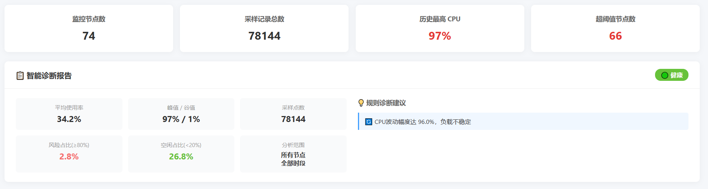
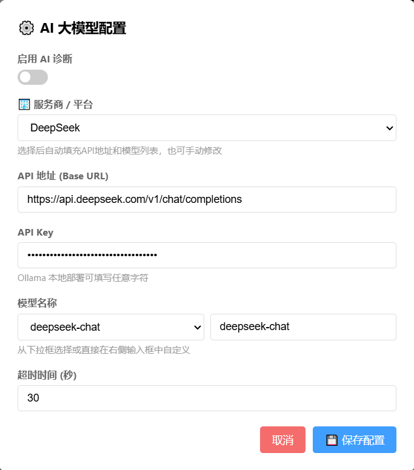

# 🖥️ CPU 监控大盘与 AI 智能诊断系统

一个基于 Flask + ECharts + LLM 的轻量级服务器 CPU 监控可视化面板。支持 CSV 数据一键导入、多维度趋势分析，并集成大语言模型（LLM）提供智能运维诊断报告。

## ✨ 核心功能

- **📊 交互式数据可视化**：基于 ECharts 实现，支持多节点对比、时间轴缩放、数据区域放大。
- **🤖 AI 智能诊断**：接入大模型（支持 OpenAI、DeepSeek、Ollama 等），自动生成专业的 SRE 运维分析报告。
- **⚙️ 可视化 AI 配置**：内置主流大模型服务商预设，界面化配置 API，支持一键切换与自定义模型。
- **📂 便捷数据导入**：支持 UTF-8/GBK 编码自动识别的 CSV 文件上传与解析。
- **🛡️ 优雅降级机制**：当 AI 接口超时或不可用时，自动切换至内置的规则引擎进行基础诊断，保证服务高可用。
- **📱 响应式设计**：完美适配 PC 与移动端浏览器。

## 📸 界面预览




## 🚀 快速开始

### 环境要求
- Python 3.8+

### 安装与运行

1. **克隆项目**
   ```bash
   git clone https://github.com/your-username/cpu-monitor-dashboard.git
   cd cpu-monitor-dashboard

2. **安装依赖**
   ```bash
   pip install -r requirements.txt
   ```

3. **启动服务**
   ```bash
   python app.py
   ```
启动后，在浏览器中访问 http://127.0.0.1:5000


### 📖 使用指南

1. 导入数据
准备包含以下表头的 CSV 文件：Node IP, Timestamp, CPU Usage(%)。
点击页面右上角的 📂 导入CSV 按钮上传文件。

2. 配置 AI 诊断
点击右上角 ⚙️ AI设置。
在“服务商/平台”下拉框中选择你使用的平台（如 DeepSeek、Ollama 等），系统会自动填充 API 地址和推荐模型。
填入你的 API Key。
开启“启用 AI 诊断”开关并保存。

3. 查看报告
选择特定的 IP 或日期，页面下方的“智能诊断报告”面板将展示 AI 生成的 Markdown 格式分析报告及风险评级。


### 🛠️ 技术栈
后端：Python, Flask, SQLite3
前端：HTML5, CSS3, JavaScript
图表：Apache ECharts
Markdown 渲染：marked.js
AI 接口：兼容 OpenAI API 标准的各类大模型

### 🤝 贡献
欢迎提交 Issue 和 Pull Request！

### 📄 许可证
本项目基于 MIT License 开源。